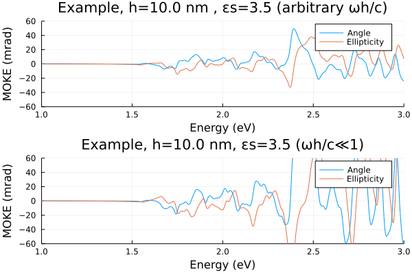

# MOKE response from vasp output
This Julia script calculates polar MOKE response from the dielectric function generated by VASP stored in the ```.h5``` file. The calculations assume a geometry in which a magnetic layer of thickness $h$ is encapsulated between the layers with the dielectric constants $\varepsilon_1 = 1$ (air) and $\varepsilon_s$ (substrate). $h$ and $\varepsilon_s$ are input parameters. The Kerr angles $\phi_K$ and ellipticities $\psi_K$ are calculated on the same frequency grid as for the input dielectric function. The corresponding expressions read
```math
\phi_K = \frac{Arg(\chi)}{2} \text{   and   } \psi_K = \frac{1 - |\chi|}{1 + |\chi|},
```
where $\chi = r_+/r_-$ and
```math
r_{\pm} = \frac{  1 - n_s - (n_s\tilde{n}_{\pm}^{-1} - \tilde{n}_{\pm})  \mathrm{tanh}(i\omega h\tilde{n}_{\pm})  }{  1 + n_s - (n_s\tilde{n}_{\pm}^{-1} + \tilde{n}_{\pm}) \mathrm{tanh}(i\omega h\tilde{n}_{\pm})  }.
```
Here, $\tilde{n} = n \sqrt{1 \pm Q}$, $n_s = \sqrt{\varepsilon_s}$, $n = \sqrt{\varepsilon_{xx}}$, and $Q = i\varepsilon_{xy}/\varepsilon_{xx}$. In the limit $\omega h/c \ll 1$, the expression above simplifies to
```math
\phi_K + i\psi_K = \frac{2n^2Q\omega h}{1- n_s^2}.
```


## Example

